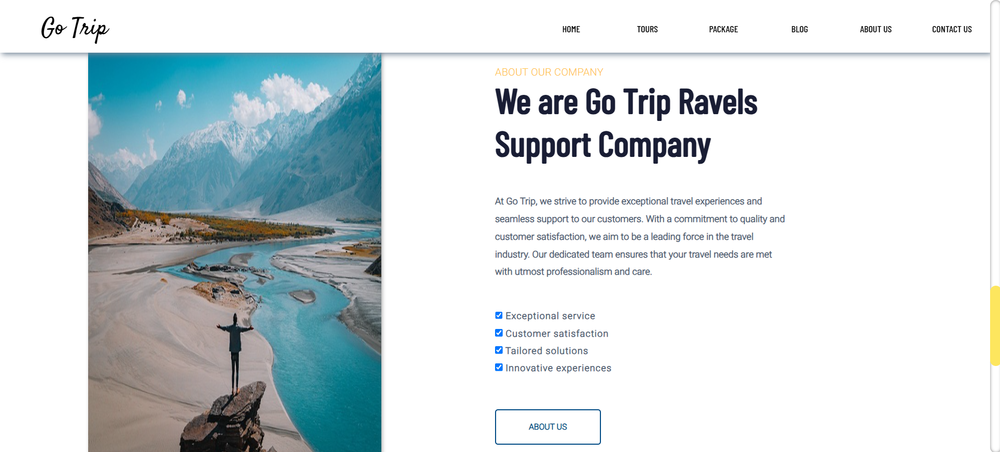

# Go Trip - Travel Agency Website

Go Trip is a visually appealing and user-friendly travel agency website designed to provide travelers with an easy and intuitive platform to explore tour packages and travel destinations.


## Features

- **Search Functionality**: Users can search for destinations and travel dates.
- **Featured Tours**: Display of popular travel destinations with detailed information such as ratings, pricing, and trip duration.


## Technologies Used

- **HTML**: Structure and content of the website.
- **CSS**: Styling and layout design.



## Installation

Follow these steps to run the project locally:

1. Clone the repository:
   ```bash
   git clone https://github.com/sugapriya-k/Travel-Website-Frontend.git
2. Navigate to the project folder: 
cd Travel-Website-Frontend
3. Open the index.html file in your browser to view the website.

##Future Improvements

- Integrating a backend to fetch dynamic tour data.
- Adding a booking system for users to reserve tours online.
- Enhancing the UI/UX for better user experience.